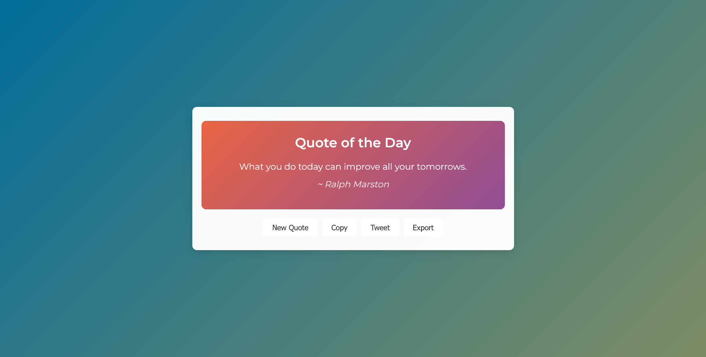

# Quote Generator

Welcome to **Quote Generator** – a stylish, responsive, and fully client-side web application that fetches inspirational quotes from a public API and presents them with eye-catching, curated gradient backgrounds. With built-in features for sharing, copying, and exporting quotes as images, this project is the perfect blend of functionality and modern design.

---

## Table of Contents

- [Features](#features)
- [Demo](#demo)
- [Screenshots](#screenshots) 
- [Installation](#installation)
- [Usage](#usage)
- [Customization](#customization)
- [Technologies Used](#technologies-used)
- [Credits](#credits)
- [License](#license)

---

## Features

- **Random Quote Fetching:** Retrieves a new quote from the [Free API](https://api.freeapi.app/api/v1/public/quotes/quote/random) each time you click the “New Quote” button.
- **Dynamic Gradient Backgrounds:** Enjoy a fresh, curated gradient background on the quote container for every new quote.
- **Copy to Clipboard:** Easily copy the quote and author text to your clipboard with a single click.
- **Social Sharing:** Share your favorite quotes on Twitter directly from the app.
- **Export as Image:** Export the quote container as a high-quality PNG image using [html2canvas](https://html2canvas.hertzen.com/).

---

## Demo

Experience the app live by opening `index.html` in your web browser. Enjoy the seamless design, interactive features, and visually appealing gradients that elevate your daily dose of inspiration.

---

## Screenshots  
  

---

## Installation

To run the project locally:

1. **Clone the Repository:**

   ```bash
   git clone https://github.com/mohdaffankhan/quote-generator.git
   ```

2. **Navigate to the Project Directory:**

   ```bash
   cd quote-generator
   ```

3. **Open `index.html` in your preferred web browser.**

   You can simply double-click the file or serve it using a local web server for a better experience.

---

## Usage

- **New Quote:** Click the "New Quote" button to fetch and display a fresh quote from the API.
- **Copy:** Click the "Copy" button to copy the quote and the author’s name to your clipboard.
- **Tweet:** Use the "Tweet" button to share the quote directly on Twitter.
- **Export:** Click the "Export" button to download the quote container as a PNG image.

The app is designed to be intuitive and user-friendly, ensuring you can focus on the inspiration rather than the interface.

---

## Customization

### Styling

- **Gradient Colors:** The quote container uses a curated list of gradients. You can modify or add new gradients in the JavaScript function `setRandomGradient()`.
- **Typography & Layout:** The project employs the Montserrat font from Google Fonts. Feel free to update the CSS to match your branding or aesthetic preferences.

### Functionality

- **API Endpoint:** The app currently uses the [Free API](https://api.freeapi.app/api/v1/public/quotes/quote/random) for quotes. You can switch to another API by updating the URL in the `getQuote()` function.
- **Export Feature:** Powered by [html2canvas](https://html2canvas.hertzen.com/), the export feature captures the quote container as an image. Adjust the export settings in the `exportImage()` function if needed.

---

## Technologies Used

- **HTML5:** Provides the structure of the web application.
- **CSS3:** Delivers a modern, responsive, and stylish design.
- **JavaScript (ES6+):** Implements the core functionality for fetching quotes, handling user interactions, and dynamic styling.
- **html2canvas:** A JavaScript library used for rendering the quote container as an image.
- **Google Fonts:** Uses the Montserrat font for enhanced typography.

---

## Credits

- **Quote API:** Thanks to [Free API](https://api.freeapi.app) for providing the quotes.
- **html2canvas:** Special thanks to the developers of [html2canvas](https://html2canvas.hertzen.com/) for the export functionality.
- **Design Inspiration:** This project draws inspiration from modern web design trends and the creative community.

---

## License

This project is open-source and available under the [MIT License](LICENSE).

---

Enjoy your inspirational journey with **Quote Generator**! If you have any suggestions or encounter issues, feel free to open an issue or submit a pull request. Happy quoting!

